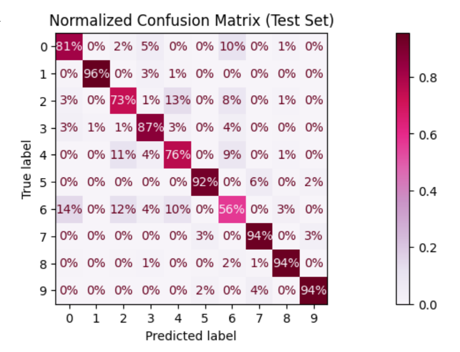

# **Fashion MNIST Classification Project**

## **Overview**
This project tackles the challenge of classifying clothing items from the [Fashion MNIST dataset](https://github.com/zalandoresearch/fashion-mnist), a dataset by Zalando containing grayscale images of 10 distinct clothing categories. It serves as a foundational exploration of machine learning techniques, focusing on building a complete pipeline using traditional models like Logistic Regression and Random Forest.jeje

The project emphasizes the practical implementation of machine learning, from data preparation to model evaluation, providing insights into both the strengths and limitations of these methods.

---

## **Objective**
The primary goal of this project is:
- To classify images into one of ten clothing categories using traditional machine learning techniques.
- To understand the challenges and limitations posed by visually similar classes in the dataset.
- To complete a structured machine learning workflow, including preprocessing, model selection, hyperparameter tuning, and evaluation.

The broader aim is to establish a solid foundation in machine learning and prepare for future projects involving more advanced techniques like Convolutional Neural Networks (CNNs).

---

## **Dataset**
The [Fashion MNIST dataset](https://github.com/zalandoresearch/fashion-mnist) consists of:
- **Training set**: 60,000 images.
- **Test set**: 10,000 images.
- Each image is a **28x28 grayscale image**, with pixel values ranging from 0 to 255.
- **Labels**: 10 clothing categories:
  1. T-shirt/top
  2. Trouser
  3. Pullover
  4. Dress
  5. Coat
  6. Sandal
  7. Shirt
  8. Sneaker
  9. Bag
  10. Ankle boot

Dataset characteristics:
- Classes like `Shirts (6)` and `Jackets (4)` are visually similar, making them harder to classify.
- Noisy and overlapping features between certain categories increase complexity.

---

## **Project Workflow**
The project follows a structured machine learning workflow:

### **1. Data Preparation**
- **Downloading**: The dataset was obtained from Kaggle using the `kagglehub` library.
- **Loading**: `.idx` files were processed using `idx2numpy` to convert them into NumPy arrays for efficient computation.

### **2. Data Preprocessing**
- **Normalization**:
  - Pixel values were scaled from `[0, 255]` to `[0, 1]` to ensure uniformity and improve model convergence.
- **Reshaping**:
  - Images were flattened from `(28, 28)` into `(784,)` vectors to work with traditional models like Logistic Regression.
- **Data Splitting**:
    - Training set: 80% of the 60,000 training images, used for training the model.
    - Validation set: 20% of the 60,000 training images, used for hyperparameter tuning and model selection.
    - Test set: A separate subset of 10,000 images provided by the dataset, reserved exclusively for final evaluation.

### **3. Model Selection**
Two models were implemented and compared:
1. **Logistic Regression**:
   - A linear model chosen for its simplicity and interpretability.
   - Hyperparameter tuning was performed using `GridSearchCV` on parameters like regularization strength (`C`) and solvers.
2. **Random Forest**:
   - A non-linear ensemble model used to explore improvements over Logistic Regression.
   - Limited performance gains due to dataset complexity.

### **4. Model Training and Hyperparameter Tuning**
- **Logistic Regression**:
  - GridSearchCV optimized the `C` parameter, identifying `C=0.1` as the best value.
  - Validation accuracy: **85.39%**.
- **Random Forest**:
  - Despite exploring multiple configurations, it achieved a similar validation accuracy of **85.05%**.

### **5. Model Evaluation**
- **Validation Set**:
  - Performance across both models was analyzed using accuracy, classification reports, and confusion matrices.
  - Key challenges identified were the misclassification of visually similar classes like `Shirts (6)` and `Jackets (4)`.
- **Test Set**:
  - Logistic Regression was selected as the final model.
  - Test accuracy: **84.39%**.
  - Similar trends were observed, with certain classes (e.g., `Shoes (1)`) performing well, while others (e.g., `Shirts (6)`) struggled.

---

## **Results**

### **Key Metrics**
- **Overall Test Accuracy**: **84.39%**.
- **Best Performing Class**: `Shoes (1)` with an F1-score of **0.97**.
- **Worst Performing Class**: `Shirts (6)` with an F1-score of **0.59**.

### **Confusion Matrix**
The confusion matrix normalized by true labels highlights:
- Misclassifications between `Shirts (6)` and `Jackets (4)`.
- Strong performance on distinct classes like `Shoes (1)` and `Ankle Boots (9)`.



---

## **Analysis and Observations**
1. **Logistic Regression**:
   - Performs well on distinct classes but struggles with visually similar ones.
   - Linear decision boundaries are insufficient for capturing complex patterns in image data.
2. **Random Forest**:
   - Marginal improvement, limited by the lack of feature engineering and inherent dataset complexity.
3. **Misclassifications**:
   - Highlight the need for more advanced models to distinguish overlapping visual features.

---

## **Limitations**
1. **Dataset Complexity**:
   - Classes like `Shirts (6)` and `Jackets (4)` are inherently challenging due to their visual similarity.
2. **Model Simplicity**:
   - Logistic Regression, as a linear model, is not well-suited for image classification tasks.
3. **No Advanced Feature Extraction**:
   - Techniques like PCA or handcrafted features were not applied.

---

## **Future Improvements**
1. **Convolutional Neural Networks (CNNs)**:
   - Implement CNNs to leverage spatial relationships in images for better classification performance.
2. **Data Augmentation**:
   - Introduce transformations like rotations, scaling, and flips to increase data diversity and model robustness.
3. **Hyperparameter Exploration**:
   - Further tuning Random Forest parameters or exploring other ensemble methods like Gradient Boosting.
4. **Advanced Architectures**:
   - Experiment with pre-trained models (e.g., ResNet, MobileNet) using transfer learning.

---

## **How to Run**
1. Clone this repository:
   ```bash
   git clone [https://github.com/crislpzalc/Fashion-MNIST-Logistic-Regression.git]
   ```
2. Install required dependencies:
   ```bash
   pip install -r requirements.txt
   ```
3. Run the project:
   - Open the `Fashion_MNIST_Zalando.ipynb` notebook and execute the cells.

---

## **Acknowledgments**
- **Dataset**: [Fashion MNIST](https://github.com/zalandoresearch/fashion-mnist) by Zalando Research.
- **Inspiration**: *Hands-On Machine Learning with Scikit-Learn, Keras, and TensorFlow* by Aurélien Géron.
